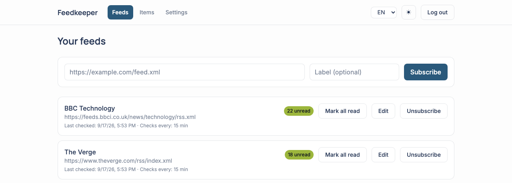
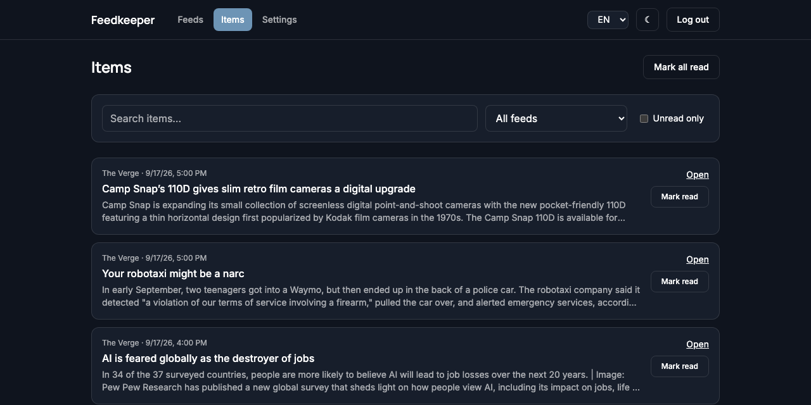
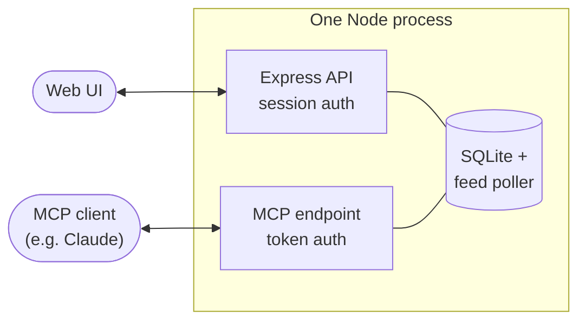

# Feedkeeper

<p align="center">
  <a href="https://github.com/visualfusion/feedkeeper/actions/workflows/ci.yml"></a>
  <a href="LICENSE"></a>
  <a href="https://modelcontextprotocol.io"></a>
  <a href="#features"></a>
  <a href="#contributing"></a>
</p>

Feedkeeper is a self-hosted RSS/Atom feed manager with a **remote-capable [MCP](https://modelcontextprotocol.io) server** built in. Subscribe to any feed — news sites, blogs, or a [Google Alerts](https://www.google.com/alerts) RSS feed — and let an MCP client like Claude read, search, and triage new items for you, from anywhere. The web UI is fully translated into English, German, and Japanese, switchable per user at any time.

It's multi-user by design: one instance can serve several people, each with their own subscriptions, read state, and API tokens.

<p align="center">
  
  
</p>

## Features

- **Any RSS/Atom feed** — not just Google Alerts, though that's what started this project.
- **Multi-user** — closed by default; an admin creates accounts (or invites people through the web UI).
- **Remote MCP access** — connect Claude Desktop, Claude Code, or any other MCP client over HTTPS from anywhere, authenticated with a personal access token. No SSH tunnel required.
- **Web UI** — subscribe/unsubscribe, browse and search items, mark things read, manage tokens and users.
- **Trilingual interface** — English, German, and Japanese, with a language switcher; each user can pick their own, independent of the others.
- **Per-feed control** — custom label, adjustable check interval (5 minutes to 24 hours), and a "mark all read" button per feed or across everything.
- **Account self-service** — change your own password from Settings.
- **Self-hosting first** — a single Node process, one SQLite file, no external services.
- **Hardened by default** — SSRF-guarded feed fetching, rate limiting, per-user data isolation, closed signup.

## How it fits together



One Node process serves the built web UI, a REST API, and an MCP endpoint (`/mcp`, using the [Streamable HTTP transport](https://modelcontextprotocol.io/docs/concepts/transports)) — all backed by the same SQLite database and feed poller.

## Quick start (local)

Requires Node.js 20+.

```bash
git clone https://github.com/visualfusion/feedkeeper.git
cd feedkeeper
npm install
cp .env.example .env
# edit .env — at minimum, set SESSION_SECRET (see the comment in the file)
npm run dev:server   # terminal 1
npm run dev:web      # terminal 2
```

Open `http://localhost:5173` and follow the onboarding screen to create the first admin account. (Prefer the terminal? `npm run setup` does the same thing without a browser.)

## Deploying

See [docs/deployment-uberspace.md](docs/deployment-uberspace.md) for a step-by-step guide to running Feedkeeper on [Uberspace](https://uberspace.de). The same steps work on any Linux host with SSH access and Node.js 20+.

For production, build once and run the compiled server:

```bash
npm run build
npm run start
```

## Connecting an MCP client

1. Log in to the Feedkeeper web UI and go to **Settings → Personal access tokens**.
2. Create a token and copy it immediately — it's only shown once.
3. Add an MCP server entry pointing at `https://<your-domain>/mcp`, sending `Authorization: Bearer <token>` as a header.

Every tool call is scoped to the token's owner — a client can only see and manage that user's own feeds and items.

### Available MCP tools

| Tool | Description |
|---|---|
| `list_feeds` | List subscribed feeds with unread counts |
| `subscribe_feed` | Subscribe to a feed URL |
| `unsubscribe_feed` | Remove a subscription |
| `get_new_items` | Fetch unread items, optionally filtered |
| `search_items` | Full-text search across all items |
| `mark_read` | Mark an item as read |

## Security

- **Closed signup by default** (`ALLOW_SIGNUP=false`). An admin creates additional accounts from Settings.
- **SSRF protection**: feed URLs are validated (and every redirect hop re-validated) against private/internal IP ranges before being fetched, so this server can't be used to probe its own host or internal network.
- **Rate limiting** on login and the general API surface.
- **Personal access tokens** are stored as salted hashes, never in plaintext.
- **Per-user data isolation**: every query is scoped to the authenticated user; feeds are deduplicated by URL under the hood, but subscriptions, read state, and tokens are always per-user.

Found a security issue? Please open an issue on GitHub or reach out to the maintainer directly rather than filing a public report for anything sensitive.

## Configuration

See [.env.example](.env.example) for all available environment variables.

## Tech stack

- **Server**: Node.js, TypeScript, Express, better-sqlite3, `@modelcontextprotocol/sdk`
- **Web**: React, Vite, Tailwind CSS, react-i18next

## Contributing

Issues and pull requests are welcome. This is a young project — expect some rough edges.

## License

[MIT](LICENSE)

---

<p align="center">Built by <a href="https://www.visualfusion.de">visualfusion</a></p>
