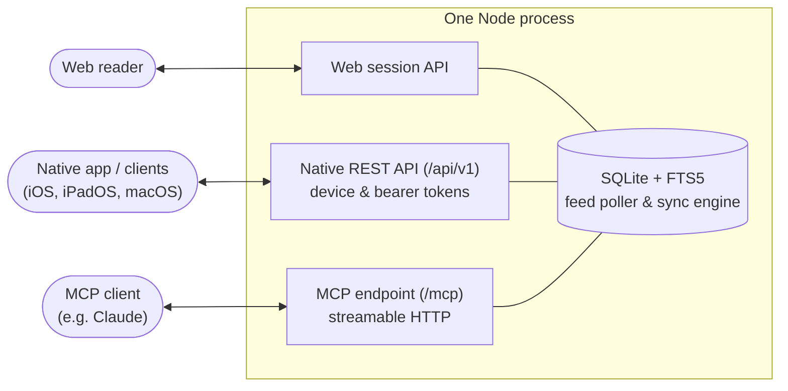

# FeedKeeper

<p align="center">
  <strong>A lightweight, self-hosted RSS reader and remote MCP server for your news, blogs, and AI workflows.</strong>
</p>

<p align="center">
  <a href="https://github.com/visualfusion/feedkeeper/actions/workflows/ci.yml"></a>
  <a href="LICENSE"></a>
  <a href="https://modelcontextprotocol.io"></a>
  <a href="#features"></a>
  <a href="#contributing"></a>
</p>

<br />

FeedKeeper is an independent RSS and Atom feed manager built for people who want full ownership over their subscriptions. It runs quietly on your own server or Raspberry Pi, stores everything in a local SQLite database, and requires zero cloud accounts.

Beyond a clean web reader, FeedKeeper includes a native, authenticated **[Model Context Protocol (MCP)](https://modelcontextprotocol.io)** endpoint. This lets MCP clients read, search, bookmark, and organize your feeds over a remote connection. Your subscriptions and reading history stay in your own SQLite database.

It is multi-user by default, with isolated accounts, personal access tokens, and a trilingual interface (English, German, and Japanese).

<p align="center">
  
  &nbsp;&nbsp;&nbsp;
  
</p>

## Why FeedKeeper?

There are good self-hosted readers already, such as Miniflux and FreshRSS. FeedKeeper is for you if you want your feeds to be part of your AI workflows without giving up ownership:

- **MCP built in.** Claude, ChatGPT and other MCP clients connect to `/mcp` directly, with OAuth sign-in or personal access tokens, read-only or read and write. Ask for a daily briefing, let an agent triage unread articles, or let it curate an edition. No separate bridge to run.
- **Small to run.** One Node process and one SQLite file, with full-text search built in. No PostgreSQL, no Redis. It runs on a Raspberry Pi or on shared hosting such as Uberspace.
- **An open API.** The REST API under `/api/v1` is described in an [OpenAPI file](docs/openapi.yaml), with offline sync, notes and editions, so third parties can build their own clients.
- **Built to be extended.** Operators can add settings, footer links or a single sign-on form to the web app without forking it, see [Extending the web app](docs/extending-the-web-app.md).

If you only need a plain, mature reader with many integrations, the established projects are the safer choice. FeedKeeper is young (version 0.x), so expect some rough edges.

## Quick start

Up and running in about a minute. Prebuilt images for `amd64` and `arm64` (including Raspberry Pi) are published to the GitHub Container Registry. You only need Docker, no clone and no build:

```bash
mkdir feedkeeper && cd feedkeeper
curl -fsSLO https://raw.githubusercontent.com/visualfusion/feedkeeper/main/compose.yaml
echo "SESSION_SECRET=$(openssl rand -hex 32)" > .env
docker compose up -d
```

Open `http://localhost:3000` to complete the initial setup via the web onboarding screen. For a public domain, also add `PUBLIC_URL=https://your.domain` to `.env` (see [`.env.example`](.env.example) for all options).

To update, pull the new image and restart:

```bash
docker compose pull
docker compose up -d
```

Changing `SESSION_SECRET` signs out active browser sessions; feeds and accounts stay in the database. Want to build the image yourself? Clone the repository and run `docker compose -f compose.yaml -f compose.build.yaml up -d --build`.

## Features

- **Categories and feed ordering** — group subscriptions into categories, search and filter the feed list, rename categories in place, and reorder feeds by dragging.
- **Smart feed discovery** — paste a direct feed link or a website address (like `example.com/blog`); FeedKeeper finds RSS and Atom feeds, including ones listed on a site's feed overview page, and checks each one before subscribing.
- **Reliable feed updates** — fetch several feeds at once with limits per source. Slow feeds and temporary failures do not hold up other updates, and unfinished work resumes after a restart.
- **Automatic character encoding** — parses standard UTF-8 as well as legacy ISO-8859-1/Windows-1252 feeds without garbled umlauts or broken symbols.
- **Saved articles as a lasting archive** — star an article to save it: FeedKeeper keeps its full text and stores its images next to the database, so it stays readable even if the source changes. Saved articles survive cleanups and unsubscribing, ignore the word filter, and their full text is searchable.
- **Full-text search** — indexed with SQLite FTS5 across titles, snippets, cached full text, and personal notes. Ranked by BM25 relevance with diacritic-insensitive matching and phrase support.
- **Article notes and lasting knowledge** — attach personal Markdown notes to any article. Notes sync across devices, export to standalone Markdown files, and protect articles permanently from retention cleanups.
- **Authoritative feed icons** — icons are cached on the server with SHA-256 hashes and conditional ETags, so devices load them fast without third-party requests.
- **Keyword mute filters** — cut through information overload by filtering out articles matching specific keywords before they reach your stream.
- **Health monitoring** — clear status indicators show polling health, consecutive fetch errors, and timestamps so you instantly spot dead feeds.
- **Universal Inbox (Read-it-Later)** — save web clippings, URLs, and personal notes directly to your personal inbox from any browser, share extension, or MCP client. Full article contents and lead images are automatically extracted and archived offline.
- **Curated editions & daily briefings** — finite morning, midday, and evening editions. Generated automatically by the server's heuristic scheduler or curated by external AI agents via MCP (e.g. Claude, local LLMs, or custom scripts), with support for structured, linked editorial overviews.
- **Automated database housekeeping** — sensible defaults prune read articles, enforce maximum item retention, and run SQLite `VACUUM` on schedule to keep storage lean.
- **Remote MCP access** — stream items directly into Claude or any MCP-compatible environment via standard Streamable HTTP, with read-only or read-write tokens, OAuth sign-in for connectors such as ChatGPT and Claude (consent page, PKCE, revocable in Settings), and cursor-based paging for incremental sync.
- **Privacy & self-hosting first** — a single Node.js process and one SQLite file. No external database engines, no telemetry, no tracking.
- **OPML 2.0 import & export** — switch back and forth from Feedly, NetNewsWire, Inoreader, or Reeder at any time.
- **Article reader & background preparation** — read feed content in the app, with persistent background full-text extraction, article-level paywall/consent tracking, and offline reader images. Full-text fetching can be tuned per subscription.
- **List and newspaper views** — switch between a compact list and an editorial layout with wide lead stories and longer previews; phones always use the newspaper layout.
- **Mobile-friendly web app** — responsive layout with tab navigation and pull to refresh, installable on the home screen, with light, dark and system themes.
- **Works offline** — a service worker lets the installed app start without a connection. It keeps your saved articles and the newest unread ones on the device with their full text and images, so you can read, search and filter them on the train. Changes such as marking read or saving are kept and sent once you are back online. Switch it off in the settings; cached data is removed when you log out.
- **Notifications and home screen shortcuts** — optional push notifications for new articles of the feeds you choose (on iPhone and iPad once the app is on the home screen), the number of unread articles of the feeds you choose on the app icon, shortcuts to saved articles and to adding a feed, and sharing a web address from another app straight into the add-feed dialog. Notifications are encrypted end to end and delivered through your browser vendor's push service; the server creates its push keys on first start and keeps them in the database.
- **Personal profiles** — each account can set its display name and a profile photo.
- **Online backups** — create verified SQLite backups while the service keeps running.
- **Passkeys and two-factor authentication** — Sign in without a password, protect password login with an authenticator app, and keep one-time recovery codes. Available on every installation; see [Account security](docs/account-security.md).
- **Hardened security** — SSRF protection against internal network probing, rate limiting on authentication, and hashed API tokens.

## How it fits together


```mermaid
flowchart LR
    WebUI(["Web reader"])
    NativeApp(["Native app / clients<br/>(iOS, iPadOS, macOS)"])
    MCPClient(["MCP client<br/>(e.g. Claude)"])

    subgraph Server["One Node process"]
        direction TB
        WebAPI["Web session API"]
        NativeAPI["Native REST API (/api/v1)<br/>device & bearer tokens"]
        MCPEP["MCP endpoint (/mcp)<br/>streamable HTTP"]
        DB[("SQLite + FTS5<br/>feed poller & sync engine")]

        WebAPI --- DB
        NativeAPI --- DB
        MCPEP --- DB
    end

    WebUI <--> WebAPI
    NativeApp <--> NativeAPI
    MCPClient <--> MCPEP
```

One Node process serves the built web reader, the open REST API (`/api/v1`), and an MCP endpoint (`/mcp`, using the [Streamable HTTP transport](https://modelcontextprotocol.io/docs/concepts/transports)) — all backed by a single SQLite database, the FTS5 search index, and the feed poller.

### Web reader, native apps, and MCP

FeedKeeper uses a single backend with clients tailored to different situations:

- **The web reader** is a straightforward browser interface for day-to-day reading, categorizing feeds, and triaging your stream.
- **Native apps (iOS, iPadOS, macOS)** build on platform features: offline sync via SQLite change logs, personal Markdown notes per article, and daily newspaper editions.
- **Remote MCP access** lets AI tools curate reading lists, search past items, and inspect candidates using the same APIs.

Features developed for native apps (such as article notes and edition scheduling) are exposed through the open API (`/api/v1`) so third-party clients can use them too.

## Back up and restore

Create a consistent SQLite backup while FeedKeeper is running:

```bash
npm run db:backup -- /safe/location/feedkeeper.sqlite
```

Without Docker, run `npm run build` once before using the backup commands. The command refuses to overwrite an existing backup and verifies its integrity. Images of saved articles live in an `archive` folder next to the database (configurable with `ARCHIVE_PATH`); the backup copies them to `<backup>.archive` and restore puts them back. Keep the backup outside the application directory and copy it to another machine or storage device.

With Docker Compose, create the backup in the mounted data volume and copy it to the host:

```bash
docker compose exec feedkeeper npm run db:backup -- /app/data/feedkeeper-backup.sqlite
docker compose cp feedkeeper:/app/data/feedkeeper-backup.sqlite ./feedkeeper-backup.sqlite
# only present if you have saved articles with images:
docker compose cp feedkeeper:/app/data/feedkeeper-backup.sqlite.archive ./feedkeeper-backup.sqlite.archive
```

To restore, **stop FeedKeeper first**, then run:

```bash
npm run db:restore -- /safe/location/feedkeeper.sqlite --force
```

Restoring replaces the configured database. Start FeedKeeper again after the command succeeds. Existing backups may need a database migration on startup if they were created with an older version.

For Docker Compose, stop the service and run the restore command in a one-off container with the backup mounted read-only:

```bash
docker compose stop feedkeeper
docker compose run --rm --no-deps -v "$PWD/feedkeeper-backup.sqlite:/restore.sqlite:ro" feedkeeper npm run db:restore -- /restore.sqlite --force
docker compose up -d feedkeeper
```

## Quick start (local development)

Requires Node.js 22.22.2+ (22.x), 24.15+ (24.x), or 26+.

```bash
git clone https://github.com/visualfusion/feedkeeper.git
cd feedkeeper
npm install
cp .env.example .env
# edit .env — at minimum, set SESSION_SECRET (see the comment in the file)
npm run dev:server   # terminal 1
npm run dev:web      # terminal 2
```

Open `http://localhost:5173` and follow the onboarding screen to create the first admin account. (Prefer the terminal? `npm run setup` does the same thing without a browser.)

## Deploying

See [docs/deployment-uberspace.md](docs/deployment-uberspace.md) for a step-by-step guide to running FeedKeeper on [Uberspace](https://uberspace.de). The same steps work on any Linux host with SSH access and a supported Node.js version.

For production, build once and run the compiled server:

```bash
npm run build
npm run start
```

## Connecting an MCP client

**With OAuth (ChatGPT, Claude and other connectors).** Add `https://<your-domain>/mcp` as a remote MCP server or custom connector. The client discovers the sign-in on its own: you log in to FeedKeeper, choose **read only** or **read and write** on the consent page, and the client gets a short-lived token (1 hour, refreshed for 30 days). Connected apps are listed under **Settings → MCP** and can be disconnected at any time. `OAUTH_ALLOWED_REDIRECT_HOSTS` can limit which hosts may register. Set `PUBLIC_URL` to the address the client reaches the server at; see [docs/design/mcp-oauth.md](docs/design/mcp-oauth.md).

**With a personal access token (scripts and clients without OAuth).**

1. Log in to the FeedKeeper web UI and go to **Settings → Personal access tokens**.
2. Create a token and copy it immediately — it's only shown once. Choose **Read only** for clients that only need to browse articles; choose **Read and write** to let the client change feeds or reading state. Existing tokens retain their previous write access.
3. Add an MCP server entry pointing at `https://<your-domain>/mcp`, sending `Authorization: Bearer <token>` as a header. Settings → MCP also offers a ready-made Claude Desktop configuration.

Every tool call is scoped to the signed-in user — a client can only see and manage that user's own feeds and items. OAuth tokens work only on `/mcp`.

### Available MCP tools

| Tool | Description |
|---|---|
| `list_feeds` | List subscribed feeds with unread counts and health status, optionally only feeds with errors |
| `subscribe_feed` | Subscribe to a feed URL or website URL (auto-discovering the feed) |
| `discover_feeds` | Discover available RSS/Atom feeds on a website URL |
| `save_to_inbox` | Save a web clipping, URL, or personal note to your inbox with automatic full-text and image archiving |
| `unsubscribe_feed` | Remove a subscription |
| `update_feed` | Change a subscription's feed URL, name, poll interval, full-text setting, push notifications or app icon count; a new URL is validated before it replaces the old one |
| `list_folders` | List folders with feed and unread counts |
| `create_folder` | Create a folder |
| `rename_folder` | Rename a folder |
| `delete_folder` | Delete a folder; its feeds stay subscribed |
| `move_feed_to_folder` | Move a subscription into or out of a folder |
| `refresh_feed` | Request an update of a subscribed feed; respects source pauses and reports pending work |
| `get_digest` | Unread articles grouped by feed with short snippets, the cheapest way to see what is new |
| `get_overview` | Counts for the whole account: unread and saved articles, top feeds, folders and failing feeds |
| `get_new_items` | Fetch unread items, optionally filtered by feed, search, or bookmarks; can leave out article HTML and shorten summaries |
| `list_items` | Page through compact items by time added; use cursors to fetch older or newly added items |
| `get_item` | Fetch one article and its cached content (HTML or plain text) with optional pagination (`offset`, `nextOffset`, `revision`) |
| `fetch_full_text` | Download and cache the full article when the feed only has a teaser; use `get_item` for subsequent paginated parts |
| `search_items` | Search titles and summaries across all items (with optional bookmarks filter) |
| `mark_read` | Mark one or more items as read |
| `mark_unread` | Mark one or more items as unread |
| `mark_all_read` | Mark all subscribed items as read, optionally within a feed or folder |
| `bookmark_item` | Save one or more items; saved items are archived with full text and images |
| `unbookmark_item` | Remove bookmarks from one or more items |
| `list_muted_keywords` | List user's active muted keywords |
| `add_muted_keyword` | Add a keyword to automatically filter out matching articles |
| `remove_muted_keyword` | Remove a muted keyword rule |
| `export_opml` | Export all subscribed feeds as an OPML 2.0 XML string |
| `import_opml` | Import feeds from an OPML 2.0 XML string |
| `get_edition` | Read the current issue, source and revision, including expired or dismissed state |
| `get_edition_candidates` | Get compact candidates respecting app section preferences and muted keywords |
| `publish_edition` | Publish an ordered curated issue with optional structured topic overviews, expiry, revision checks and safe retries |
| `generate_edition` | Ensure an automatic issue exists, or explicitly request a new selection |
| `dismiss_edition` | Dismiss the shared issue with revision and replay protection |
| `get_native_preferences` | Read app-only section order, newspaper visibility and edition preferences |
| `update_native_preferences` | Patch shared app preferences without changing the web reader |
| `cleanup_database` | *(Admin only)* Purge old items and reclaim disk space after deletions |

Besides tools, the server offers prompts (`daily_briefing`, `catch_up_on_topic`, `saved_reading_list`, `triage_unread`) and resources (`feedkeeper://feeds`, `opml`, `saved`, `digest` and `feedkeeper://items/{id}`) that clients can show as ready-made actions.

Read-only tokens expose only the tools that leave FeedKeeper data unchanged. `get_item` returns stored feed or reader content; `fetch_full_text` downloads the article from its website and needs a read-and-write token. Item actions accept a single `itemId` or up to 200 `itemIds`. `get_new_items`, `search_items` and `list_items` accept `since` and `until` (ISO date or date-time) to filter by publish date. For incremental synchronization, save `newestCursor`, pass it as `after` next time, and follow `nextCursor` as `before` until there are no more pages.

## Native apps

A native app for **iOS, iPadOS and macOS** is in development. It uses the API under `/api/v1`, which is open and described in [docs/openapi.yaml](docs/openapi.yaml): pair a device with a QR code from **Settings → Devices**, sync your subscriptions and reading state incrementally, keep articles offline, and queue changes made without a connection. The API also provides background article preparation (`/items/prepare`), full-text search with FTS5, synchronized article notes, SF Symbols for sections/categories, a personal inbox (`/inbox`), and shared automatic or MCP-curated editions with linked overviews. App-only section order and newspaper visibility sync without changing the web reader. See [the edition contract](docs/design/editions.md) for generation, priorities, preferences and offline handling. Native push through an external relay remains planned (see [docs/design/native-api.md](docs/design/native-api.md)).
Third-party clients are welcome to build on the same API — see [docs/building-clients.md](docs/building-clients.md) for a getting-started guide.

## Security

- **Closed signup by default** (`ALLOW_SIGNUP=false`). An admin creates additional accounts from Settings.
- **SSRF protection**: feed URLs and redirects are checked before fetching and again when connecting. Private/internal addresses are blocked by default. On trusted instances that need local feeds, set `ALLOW_PRIVATE_FEEDS=true`.
- **Rate limiting** on login and the general API surface.
- **Personal access tokens** are stored as salted hashes, never in plaintext.
- **OAuth 2.1 for MCP** with required PKCE, expiring tokens, refresh-token rotation with reuse detection, and a consent page that asks every time.
- **Behind a proxy or CDN**: `TRUST_PROXY` and `CLIENT_IP_HEADER` make sure rate limits see the real client address.
- **Per-user data isolation**: every query is scoped to the authenticated user; feeds are deduplicated by URL under the hood, but subscriptions, read state, and tokens are always per-user.

Feed icons and the images of saved articles are delivered by the FeedKeeper server, so browsing does not contact third-party sites for them; images of other articles still load from their source websites. To find a feed's icon, the server fetches the site's homepage about once a week. Opening a full article through the reader also fetches that page from the FeedKeeper server.

Found a security issue? Please report it privately as described in [SECURITY.md](SECURITY.md) instead of opening a public issue.

## Configuration

See [.env.example](.env.example) for all available environment variables.

### Feed updates

By default, FeedKeeper checks up to four feeds at once, with at most two requests per source hostname. Scheduled and manual updates, new subscriptions, OPML imports and MCP share the same queue. A manual refresh may stay pending when a source is busy or has asked for a pause; the web reader tells you when this happens.

Run **one application process per database**. On hosts with little memory, start with `POLL_CONCURRENCY=2` and `POLL_HOST_CONCURRENCY=1`. Allow 45 seconds for shutdown; the supplied Docker Compose file already does this. See [Feed polling](docs/feed-polling.md) for the settings, logs and upgrade guidance.

## Extending

Operators and products built on FeedKeeper can add settings sections, footer links and a custom sign-in to the web app through `window.feedkeeperExtensions`, without patching the code. See [Extending the web app](docs/extending-the-web-app.md).

## Tech stack

- **Server**: Node.js, TypeScript, Express, better-sqlite3, `@modelcontextprotocol/sdk`
- **Web**: React, Vite, Tailwind CSS, react-i18next

## Contributing

Issues and pull requests are welcome — see [CONTRIBUTING.md](CONTRIBUTING.md) for how to get started. Improving or adding a language is a good first contribution, see [docs/translating.md](docs/translating.md). Notable changes are listed in the [changelog](CHANGELOG.md). This is a young project, so expect some rough edges.

## License

[MIT](LICENSE)

---

<p align="center">Built by <a href="https://www.visualfusion.de">visualfusion</a></p>
